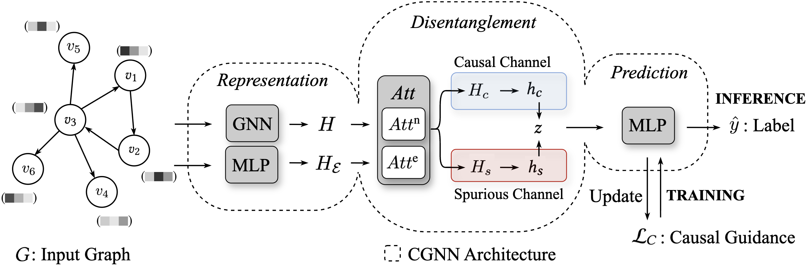

# CIF: Causal Information Flow-based training for CGNNs
This repository contains the code for the paper "The Causal Information Flow of Graph Neural Networks". 

Causal Graph Neural Networks (CGNNs) follow the Representation-Disentanglement-Prediction (RDP) pipeline. As depicted in the figure below, CGNNs first encode the input graph into the latent space (Representation). Subsequently, they separate or disentangle causal from spurious features in said representation space (Disentanglement). Finally, they make a label prediction based on the disentangled representation (Prediction).
     


## Installation
Create a virtual environment (optional but recommended):
```bash

conda create -n cgnns python=3.9
conda activate cgnns
```
Install requirements (adjust the CUDA version to your hardware as necessary):
```bash
pip install torch==2.3.0 --index-url https://download.pytorch.org/whl/cu121
pip install torch_geometric==2.5.3
pip install torch_scatter torch_sparse -f https://data.pyg.org/whl/torch-2.3.0+cu121.html
pip install -r requirements.txt
```

## Data preparation
Please navigate to data_scripts/datasets.py for the full instructions. In short: 

### Step 1: Create a data folder 
Before downloading and processing the data, create a a data folder
```bash
mkdir data
```

### Step 2: Downloading the datasets
   - SYN requires manual generation. The dataset can be generated by navigating to data_scripts/data_preparation/SYN_gen/ and running
      ```bash
      
      python generate_SYN.py
      ```
      This generates the multi-class (4 class) version of the SYN dataset. If you want to create the binary version of the dataset you can do so       by running 
      ```bash
      
      python generate_SYN.py --binary
      ```
   - SPMotif requires manual generation. The dataset can be generated by navigating to data_scripts/data_preparation/spmotif_gen/ and running
      ```bash
      
      python spmotif.py
      ```
   - MNIST requires manual download: https://drive.google.com/drive/folders/1Prc-n9Nr8-5z-xphdRScftKKIxU4Olzh
   - Graph-SST2 requires manual download: https://mailustceducn-my.sharepoint.com/personal/yhy12138_mail_ustc_edu_cn/_layouts/15/onedrive.aspx?id=%2Fpersonal%2Fyhy12138%5Fmail%5Fustc%5Fedu%5Fcn%2FDocuments%2Fpaper%5Fwork%2FGNN%20Explainability%20Survey%2FSurvey%5FText2graph&ga=1
      Place MNISTSP and Graph-SST2 in the data folder.
   - Molhiv can be downloaded automatically.
   
Once you have manually downloaded the aforementioned files please navigate to the data_scripts folder and run

```bash
python compute_dataset_stats.py
```

If you see all dataset names along with their description printed in your terminal then the download and pre-processing was sucessful.

## Experiments 
### CGNN Training 
To train a CGNN with a specific training paradigm, navigate to the src folder and run

```bash
python run_experiments.py --model [MODEL] --backbone [BACKBONE] --dataset [DATASET]
```

where

- `--model`: CIF (ours), GNN, DIR, CAL, ICL, ACE
- `--backbone`: GCN, GAT, GIN, GraphGPS, GrokFormer, DualFormer
- `--dataset`: Graph_SST2, Molhiv, SPMotif_b_{05,07,09}, SYN_multi_b_{01,03,05,07,09}, MNIST_75sp_n{02,04,06,08}

A single call runs hyperparameter tunning, training and testing over 5 different seeds (28, 1999, 1130, 5898, 820) with the best found hyperparameters.

### Experiment Reproducibility
To reproduce our experimental results please run,

```bash
chmod +x run_experiments.sh
./run_experiments.sh
```

Please keep in mind that this will generate a total of 2520 results files and will take more or less time depending on your hardware. 